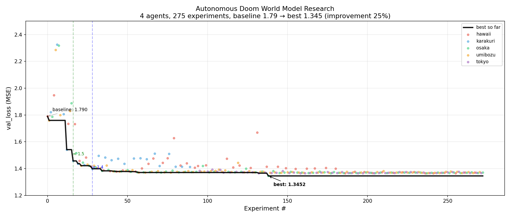

# autoresearch-wm



Autonomous world model research, adapted from [karpathy/autoresearch](https://github.com/karpathy/autoresearch).

Trains a causal diffusion transformer (DiT) on Doom latent frames using diffusion forcing. The model operates in DC-AE latent space (32x spatial compression, 32 channels) on pre-encoded PvP deathmatch gameplay.

Based on [toy-wm](https://github.com/wendlerc/toy-wm).

## Quick start

```bash
uv sync
uv run prepare.py           # download 5 shards (~20 GB)
uv run train.py             # train for 10 minutes, print val_loss
```

## How it works

Three files:

- **`prepare.py`** — Downloads DC-AE latent shards from HuggingFace. Run once. Do not modify.
- **`train.py`** — Single-file DiT + diffusion forcing trainer. The agent modifies this to improve `val_loss`.
- **`program.md`** — Instructions for the AI agent.

## Project structure

| File | Role |
|------|------|
| `prepare.py` | Data download (read-only) |
| `train.py` | Model + training (agent-editable) |
| `program.md` | Agent instructions |
| `pyproject.toml` | Dependencies |

## Configuration

All hyperparameters are constants at the top of `train.py`:

- **Architecture**: `D_MODEL=384`, `N_HEADS=24`, `N_BLOCKS=12`, `PATCH_SIZE=2`, `N_WINDOW=30`
- **Training**: `BATCH_SIZE=64`, `LR1=0.02`, `LR2=3e-4`, `ACTION_DROPOUT=0.2`
- **Budget**: `TIME_BUDGET=600` (10 minutes)

## Metric

`val_loss` — MSE on held-out doom latent clips (lower is better).
